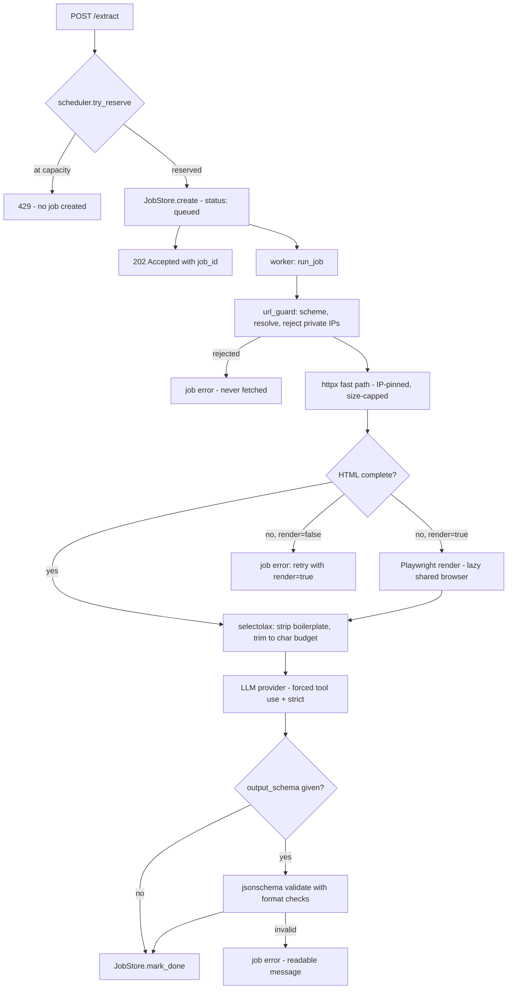

# AI-Web-Scraper

[](https://www.python.org/downloads/)
[](https://github.com/SidVaidya2005/AI-Web_Scraper/actions/workflows/ci.yml)
[](LICENSE)

Give it a URL and a sentence describing what you want. It fetches the page,
renders JavaScript when you ask it to, strips the boilerplate, and uses an LLM to
hand back exactly the structured JSON you described — no CSS selectors, no XPath,
no per-site scraper to maintain when the markup changes.

Traditional scrapers break the moment a site reshuffles its DOM. Here the
extraction contract is a prompt plus an optional JSON Schema, so the same request
works across sites that share nothing but meaning.

Under the hood it is a single-process FastAPI service built around the parts that
are actually hard about doing this safely:

- **An SSRF guard on every fetch** — scheme allow-list, host resolution, and
  rejection of loopback/private/link-local/metadata addresses, re-checked on every
  redirect. The HTTP path **pins the validated IP**, closing the DNS-rebinding
  resolve→connect race.
- **Untrusted page content treated as data** — scraped text is fenced and framed by
  a system prompt, and output is constrained to a forced tool schema, so a page
  cannot rewrite the extraction contract.
- **A bounded async scheduler** — atomic admission control (no TOCTOU overshoot), a
  concurrency semaphore, retained task references (never fire-and-forget), and a
  graceful shutdown that drains in-flight jobs instead of stranding them.

## How it works



Jobs run asynchronously in memory. You submit, get a `job_id` immediately, poll
until it reaches a terminal state, then read or export the result. Nothing is
persisted — the registry lives in one process and is lost on restart.

## Quickstart

```bash
uv sync                                 # install dependencies
cp .env.example .env                    # then set ANTHROPIC_API_KEY (or OPENAI_API_KEY)
uv run uvicorn app.main:app --reload    # API + dashboard on http://127.0.0.1:8000
```

Optional, and only if you intend to use `render=true` — Chromium is launched
lazily, so HTTP-only runs never need it:

```bash
uv run playwright install chromium
```

> **Run a single worker.** Job state lives in memory in one process. Multiple
> workers each keep a separate registry, so a job submitted to one becomes
> invisible to polls that land on another. Every restart drops all jobs.

The service binds **loopback (`127.0.0.1`) and ships with no authentication**. It
is built for local, single-user use — see [Security](#security-and-responsible-use)
before putting it anywhere else.

## Example

Submit a job, pinning the output shape with a JSON Schema:

```bash
curl -X POST http://127.0.0.1:8000/extract \
  -H 'Content-Type: application/json' \
  -H 'Origin: http://127.0.0.1:8000' \
  -d '{
    "url": "https://example.com/store/laptops",
    "prompt": "Extract every product with its name, price in USD, and stock status.",
    "output_schema": {
      "type": "object",
      "properties": {
        "items": {
          "type": "array",
          "items": {
            "type": "object",
            "properties": {
              "name":  {"type": "string"},
              "price": {"type": "number"},
              "in_stock": {"type": "boolean"}
            },
            "required": ["name", "price", "in_stock"]
          }
        }
      },
      "required": ["items"]
    }
  }'
```

Returns `202` immediately:

```json
{
  "job_id": "3ebfc24d-1e4e-4130-afa5-f336560f2013",
  "status": "queued",
  "url": "https://example.com/store/laptops",
  "mode": null,
  "result": null,
  "error": null,
  "created_at": "2026-08-19T13:37:44.593524Z",
  "started_at": null,
  "finished_at": null
}
```

Poll it with `GET /jobs/{job_id}` until `status` is `done` or `error`:

```json
{
  "job_id": "3ebfc24d-1e4e-4130-afa5-f336560f2013",
  "status": "done",
  "mode": "http",
  "result": {
    "items": [
      {"name": "ThinkPad X1 Carbon", "price": 1429.00, "in_stock": true},
      {"name": "MacBook Air 13\"",   "price": 1099.00, "in_stock": true},
      {"name": "Dell XPS 15",        "price": 1899.99, "in_stock": false}
    ]
  },
  "error": null,
  "created_at": "2026-08-19T13:37:44.593524Z",
  "started_at": "2026-08-19T13:37:44.593884Z",
  "finished_at": "2026-08-19T13:37:49.118203Z",
  "fetch_ms": 412,
  "extract_ms": 4092,
  "total_ms": 4524,
  "content_truncated": false
}
```

**The result is always a JSON object.** A tool call's arguments are an object by
definition, so a list extraction comes back wrapped under a key (`items` above) —
never a bare top-level array. Your schema's root must be `type: "object"` for the
same reason.

A failure never crashes the server or its sibling jobs; it lands as a readable
message on the job itself:

```json
{"status": "error", "error": "refusing to fetch non-public address '169.254.169.254'"}
```

## API

| Endpoint | Purpose |
| -------- | ------- |
| `POST /extract` | Submit a job (`url`, `prompt`, optional `output_schema`, `provider`, `render`). → `202` with `job_id`. `422` on a malformed schema, `429` when the admission cap is full, `503` while shutting down. |
| `GET /jobs/{job_id}` | Poll one job: status, `result` or `error`, fetch mode, timings. `404` if unknown. |
| `GET /jobs` | List this process's jobs, newest first. |
| `GET /jobs/{job_id}/export?format=json\|csv` | Download the result. `404` unknown, `409` if the job has no result, `422` on a bad format. |
| `GET /health` | Liveness only — `200` whenever the process is up. Does not probe the browser or providers. |
| `GET /` | Dashboard: submit form plus a live jobs table (HTMX-polled). |
| `GET /jobs/{job_id}/view` | Server-rendered detail page for one job, with export buttons. |

State-changing routes enforce an `Origin` check, and the app runs behind a
Host-header allow-list — cheap defenses against a malicious page in your browser
quietly driving the local service.

## Configuration

All settings are read from the environment (or `.env`) in exactly one place,
`app/config.py`. The ones you are most likely to touch:

| Variable | Default | Purpose |
| -------- | ------- | ------- |
| `LLM_PROVIDER` | `anthropic` | Which provider to use — `anthropic` or `openai`. |
| `ANTHROPIC_API_KEY` | — | Required when the provider is `anthropic`. |
| `ANTHROPIC_MODEL` | `claude-sonnet-4-6` | Model id for the Anthropic provider. |
| `OPENAI_API_KEY` / `OPENAI_MODEL` | — | Required when the provider is `openai` (the model has no default). |
| `MAX_CONTENT_CHARS` | `50000` | Character budget sent to the LLM — a coarse cost cap, not a token count. |
| `MAX_CONCURRENT_JOBS` | `4` | How many jobs run at once. |
| `MAX_QUEUED_JOBS` | `50` | Admission cap on in-flight plus waiting jobs; over it, submits are rejected. |
| `RESPECT_ROBOTS` | `true` | Honor `robots.txt`. Turn off only for sites you own. |

The remaining eighteen cover timeouts, retries, size caps, rate limiting, job
retention, and binding. Every one is documented with its default in
[`.env.example`](.env.example). Settings that must hold a relationship
(`MAX_CONCURRENT_JOBS <= MAX_QUEUED_JOBS <= MAX_JOBS`) are validated at startup, so
a plausible-looking misconfiguration fails fast instead of misbehaving later.

## Architecture

Each package owns exactly one concern, and the boundaries are enforced rather than
suggested:

| Package | Owns |
| ------- | ---- |
| `app/api/` | JSON endpoints. Validates input, creates/queries jobs. No scraping, cleaning, or LLM logic. |
| `app/dashboard/` | Server-rendered pages and HTMX partials over the same services the API uses. |
| `app/fetching/` | The only place `httpx` and Playwright appear. Owns the SSRF guard, rate limiting, and robots handling. |
| `app/cleaning/` | Raw HTML → cleaned, character-bounded text. No network, no AI, no job state. |
| `app/extraction/` | Cleaned content + prompt/schema → validated data. Talks to `LLMProvider` only. |
| `app/providers/` | The only place `anthropic` / `openai` are imported, behind one `extract()` method. |
| `app/jobs/` | Job lifecycle, in-memory registry, bounded scheduler, async runner. |
| `app/config.py` | The only place environment variables are read. |

Three invariants a change is most likely to break, and must not:

1. **LLM SDK imports live only in `app/providers/`.** Everything else depends on the
   `LLMProvider` protocol, which is why swapping `LLM_PROVIDER` between `anthropic`
   and `openai` needs no code change and produces the same response shape.
2. **Target-page network I/O lives only in `app/fetching/`**, and never runs before
   the SSRF guard has validated the URL.
3. **Background work goes through the scheduler**, never a bare
   `asyncio.create_task` — an unretained task can be garbage-collected mid-flight.

The full set, along with the data model and the fetch-fallback decision matrix,
lives in [`context/architecture.md`](context/architecture.md). The `context/`
folder is the project's source of truth: read
[`project-overview.md`](context/project-overview.md) for scope and the threat
model, [`code-standards.md`](context/code-standards.md) for the rules every change
follows, and [`build-journal.md`](context/build-journal.md) for why past decisions
went the way they did.

## Development

```bash
uv run pytest                              # 284 passing, 1 skipped
uv run ruff check . && uv run ruff format .
```

The suite is deterministic by design: LLM providers are mocked and pages come from
local HTML fixtures — including SPA-shell, oversized, redirecting, and hostile
fixtures. No test makes a live network call or a real LLM request, so the whole
thing runs offline and costs nothing.

## Security and responsible use

This tool fetches arbitrary user-supplied URLs server-side — textbook SSRF, made
worse by running next to localhost and cloud-metadata endpoints. It is defended
accordingly: every URL passes the guard before any request, redirects are
re-validated, responses are size-capped, timeouts are enforced, a descriptive
User-Agent is sent, and `robots.txt` and per-host rate limits are honored by
default.

**The SSRF protection is precise, not absolute.** The HTTP fast path pins the
validated IP and hard-caps the response size before buffering. Headless-browser
rendering **cannot pin** without an egress proxy, so it carries a **residual
DNS-rebinding risk** and only a best-effort size cap — which is exactly why
rendering is **opt-in** (`render: true`, off by default). The default path is
HTTP-pinned only, and the residual is confined to requests that deliberately
enable it. An IP-pinning egress proxy is the complete fix, and a known follow-up.

**Do not expose this service publicly.** It has no authentication, no CSRF tokens,
and single-process in-memory state. Loopback binding is part of the security model,
not an accident of local development. Any deployment widens the trust boundary to
whatever private network it sits on, and is acceptable only if you trust everything
on that network. A public bind needs authentication, CSRF tokens, and the egress
proxy first — all currently unbuilt. See
[`context/project-overview.md`](context/project-overview.md) → Security model for
the full threat model.

It performs no anti-bot evasion, CAPTCHA solving, proxy rotation, or login
automation, and it will not crawl beyond the single URL you give it. You are
responsible for complying with each target site's terms of service, copyright, and
applicable data-protection law before scraping it.

## License

MIT — see [LICENSE](LICENSE).
